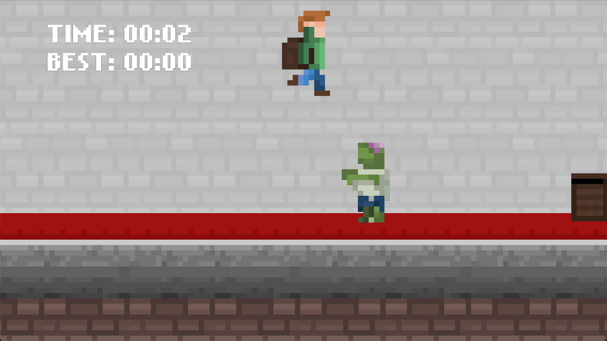

# Infinite Runner

A side-scrolling endless runner: the player character auto-runs while furniture, crates,
and a zombie spawn ahead and have to be jumped. The run ends when the player falls behind
the camera; the best time survived is kept between sessions.

## Engine features demonstrated

- **2D physics** — the player is a dynamic `RigidBody2D` with a `BoxCollider2D`;
  jumping ([`Player.lua`](Scripts/Player.lua)) is a velocity change gated on
  `rigidBody:GetLinearVelocity().y == 0.0`, i.e. only jump while grounded.
- **Animated sprites** — `AnimatedSpriteComponent` + `.spritesheet` assets
  (`SpriteSheets/Person.spritesheet`, `Zombie.spritesheet`) drive the run/idle animation
  swap in `Player.lua`.
- **Prefabs via scene instancing** — each obstacle (`Scenes/Crate.scene`,
  `Chair.scene`, `Desk 1/2/3.scene`, `Zombie.scene`, `Dresser.scene`, `Trash.scene`) is a
  tiny standalone scene, loaded once with `LoadScene` and stamped into the world
  repeatedly with `Scene:InstantiateScene` — see [`Spawner.lua`](Scripts/Spawner.lua).
- **Procedural spawn timing** — the spawner picks a random obstacle and a random
  interval (`math.random`) each cycle, so obstacle order and spacing are never the same
  twice.
- **Camera-relative world queries** — `Player.lua`, `Wall.lua`, and `Floor.lua` all read
  `Camera:GetOrthoSize()` / `GetAspectRatio()` to compute what's currently on/off screen,
  rather than hard-coding screen bounds.
- **Scrolling background via material offset, not movement** — `Floor.lua` and
  `Wall.lua` don't move their entities at all; they scroll by animating
  `Material:SetTextureOffset()` on a `Primitive` plane each frame, and resize that plane
  live (`Primitive:SetPlane(...)`) whenever the camera's viewport size changes.
- **Text UI + persistence** — [`Score.lua`](Scripts/Score.lua) formats elapsed time onto
  a `TextComponent`, and saves/loads the best time to a file under
  `App.GetDocumentDirectory()` using plain Lua `io`, so a record persists across runs.
- **Window/input control from script** — `Score.lua` also calls
  `Input.DisableCursor()` and toggles `App.SetWindowMode(WindowMode.Full_Screen)` on a
  key press.
- **Scene restart** — when the player falls off the back of the screen,
  `ChangeScene("Scenes/Main.scene")` reloads the level from scratch.
- **Sprite atlas** — `Generated/SpriteAtlas/` shows the editor's automatic atlas packing
  for this project's individually-referenced sprites.
