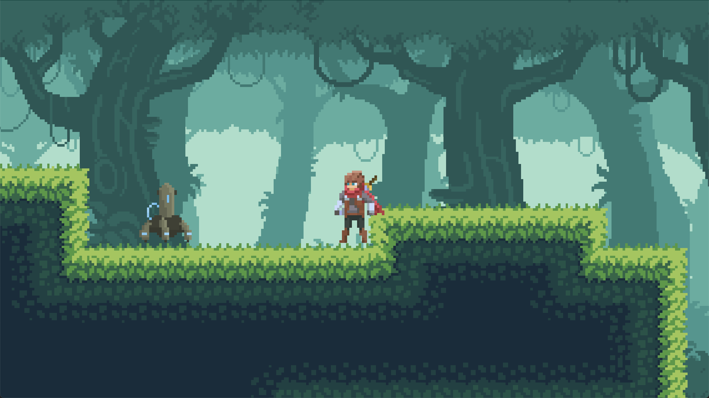
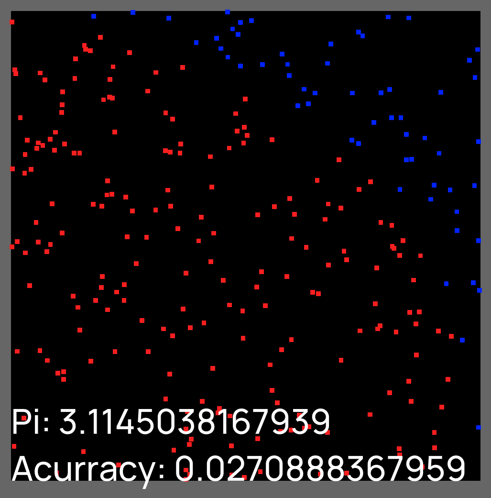

# Example Game Projects

Companion projects for the [Cross-Platform Game Engine](https://github.com/ThomasJowett/Cross-Platform-Game-Engine)
— each one is a complete, playable project folder (a `.proj` file, scenes, scripts, and
assets) that exercises a different slice of the engine, from 2D physics and animation to
UI, audio, and pure scripting.

## Opening a project

Each subfolder is a self-contained engine project — there's no build step.

- **Editor**: `File > Open Project...` and pick the project's `.proj` file, or pass the
  path on the command line (`Editor <path-to>.proj`).

See the engine's [Getting Started](https://thomasjowett.github.io/Cross-Platform-Game-Engine/getting-started/)
guide for more detail.

## Projects

| | Project | What it is | Notable engine features |
|---|---|---|---|
|  | [InfiniteRunner](InfiniteRunner/) | Endless side-scrolling runner | Physics-driven jumping, animation state switching, prefab spawning, save-to-disk high score, fullscreen toggle |
|  | [SideScrollingPlatformer](SideScrollingPlatformer/) | 2D platformer with an enemy | Tilemaps, parallax backgrounds, gamepad input, signal-driven audio, camera follow, AI components |
|  | [Solitaire](Solitaire/) | Klondike card game | Fully procedural content, mouse picking, runtime texture swapping, a Lua-only game/UI layer with no physics |
|  | [MonteCarlo](MonteCarlo/) | Monte Carlo estimation of π | Minimal scripting sandbox: runtime entity spawn/destroy, flat-tint sprites, live text output |
