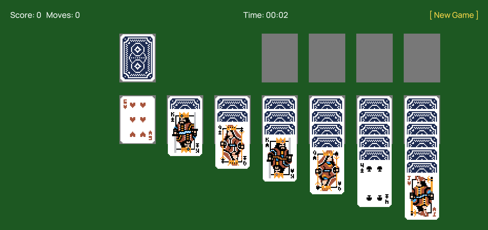

# Solitaire

A complete, playable Klondike solitaire: click-drag cards between the tableau,
foundations, and waste, draw from the stock, double-click a card to send it straight to
its foundation, and start over with New Game. Unlike the other examples, every card
entity is created procedurally at runtime rather than hand-placed in the scene.

## Engine features demonstrated

- **Fully procedural content** — [`GameManager.lua`](Scripts/GameManager.lua) builds all
  52 card entities itself in `OnCreate` (`CurrentScene:CreateEntity`, then
  `AddTransformComponent`/`AddSpriteComponent`); [`Main.scene`](Scenes/Main.scene) only
  contains the camera, table background, UI text, and the manager entity — nothing about
  the deck is authored by hand.
- **Mouse picking and dragging without physics** — cards have no colliders at all.
  `Scene:ScreenToWorldPoint` converts `Input.GetMousePos()` into world space each frame,
  and `Input.IsMouseJustPressed`/`IsMouseButtonReleased` give clean press/release edges;
  hit-testing and dragging are then plain rectangle math against the game's own layout
  model, driven entirely from Lua.
- **Runtime texture swapping** — flipping a card face up/down is
  `sprite.Texture = AssetManager.GetTexture("Sprites/...png")`, changing a
  `SpriteComponent`'s texture on the fly rather than toggling between two pre-placed
  sprites.
- **Draw-order via Z, not a sorting layer** — stacked/overlapping cards are ordered
  purely by giving later cards in a pile a slightly larger `Transform.Position.z`.
- **A non-trivial game entirely in one script** — all Klondike rules, the pile data
  model, scoring, a timer, and win detection live in Lua tables and functions on a single
  `GameManager` entity, rather than being spread across many small per-entity scripts —
  showing the engine supports a "one script owns the whole simulation" architecture just
  as well as the more distributed style used in the other example projects.
- **Physics-free 2D UI text** — score, timer, and win-state feedback are plain
  `TextComponent` entities positioned in world space and updated directly from the
  manager script, with no `Canvas`/`Widget` UI layer involved.
